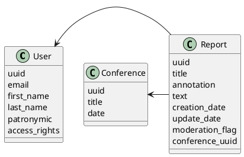

# Компонентная архитектура

## Компонентная диаграмма

```plantuml
@startuml
!include https://raw.githubusercontent.com/plantuml-stdlib/C4-PlantUML/master/C4_Container.puml

AddElementTag("microService", $shape=EightSidedShape(), $bgColor="CornflowerBlue", $fontColor="white", $legendText="microservice")
AddElementTag("storage", $shape=RoundedBoxShape(), $bgColor="lightSkyBlue", $fontColor="white")

Person(admin, "Администратор")
Person(moderator, "Модератор")
Person(user, "Пользователь")

System_Ext(web_site, "Клиентский веб-сайт", "HTML, CSS, JavaScript, React", "Веб-интерфейс")

System_Boundary(conference_site, "Сайт конференций") {
   Container(user_service, "Сервис авторизации", "Python", "Сервис управления пользователями", $tags = "microService")    
   Container(report_service, "Сервис докладов", "Python", "Сервис управления докладами", $tags = "microService") 
   Container(conference_service, "Сервис конференций", "Python", "Сервис управления конференциями", $tags = "microService")   
   ContainerDb(db, "База данных", "MySQL", "Хранение данных о пользователях, докладах и конференциях", $tags = "storage")
}

Rel(admin, web_site, "Просмотр, добавление и редактирование информации о пользователях, конференциях и докладах")
Rel(moderator, web_site, "Модерация контента и пользователей")
Rel(user, web_site, "Регистрация, просмотр информации о конференциях и докладах и запись на них")

Rel(web_site, user_service, "Работа с пользователями", "/user")
Rel(user_service, db, "INSERT/SELECT/UPDATE", "SQL")

Rel(web_site, report_service, "Работа с докладами", "/report")
Rel(report_service, db, "INSERT/SELECT/UPDATE", "SQL")

Rel(web_site, conference_service, "Работа с конференциями", "/conference")
Rel(conference_service, db, "INSERT/SELECT/UPDATE", "SQL")
@enduml
```

## Список компонентов  

### Сервис авторизации
**API**:
- Создание нового пользователя
  - входные параметры: электронная почта, имя, фамилия, отчество, права доступа
  - выходные параметры: уникальный идентификатор, электронная почта, имя, фамилия, отчество, права доступа
- Получение пользователя по уникальному идентификатору
  - входные параметры: электронная почта
  - выходные параметры: уникальный идентификатор, электронная почта, имя, фамилия, отчество, права доступа
- Получение пользователя по электронной почте
  - входные параметры: электронная почта
  - выходные параметры: уникальный идентификатор, электронная почта, имя, фамилия, отчество, права доступа
- Редактирование пользователя
  - входные параметры: уникальный идентификатор, новая электронная почта, новое имя, новая фамилия, новые права доступа
  - Выходные параметры: уникальный идентификатор, электронная почта, имя, фамилия, права доступа
- Удаление пользователя
  - входные параметры: уникальный идентификатор
  - выходные параметры: отсутствуют

### Сервис докладов
**API**:
- Создание доклада
  - входные параметры: название, аннотация, текст
  - выходные параметры: уникальный идентификатор, название, аннотация, текст, дата создания, дата обновления, флаг модерации
- Получение доклада
  - входные параметры: уникальный идентификатор
  - выходные параметры: уникальный идентификатор, название, аннотация, текст, дата создания, дата обновления, флаг модерации
- Редактирование доклада
  - входные параметры: уникальный идентификатор, название, аннотация, текст, флаг модерации
  - выходные параметры: уникальный идентификатор, название, аннотация, текст, дата создания, дата обновления, флаг модерации
- Удаление доклада
  - входные параметры: уникальный идентификатор, название, аннотация, текст, флаг модерации
  - выходные параметры: отсутствуют

### Сервис конференций
**API**:
- Создание конференции
  - входные параметры: название, дата
  - выходные параметры: уникальный идентификатор, название, дата
- Редактирование конференции
  - входные параметры: уникальный идентификатор, название, дата
  - выходные параметры: уникальный идентификатор, название, дата
- Удаление конференции
  - входные параметры: уникальный идентификатор
  - выходные параметры: отсутствуют
- Добавления доклада в конференцию
  - входнае параметры: уникальный идентификатор конференции, уникальный идентификатор доклада
  - выходные парамтеры: отсутствуют
- Удаление доклада из конференции
  - входнае параметры: уникальный идентификатор конференции, уникальный идентификатор доклада
  - выходные парамтеры: отсутствуют
- Получение списка докладов конференции
  - входные параметры: уникальный идентификатор конференции
  - выходные параметры: список[уникальный идентификатор доклада]

### Модель данных

